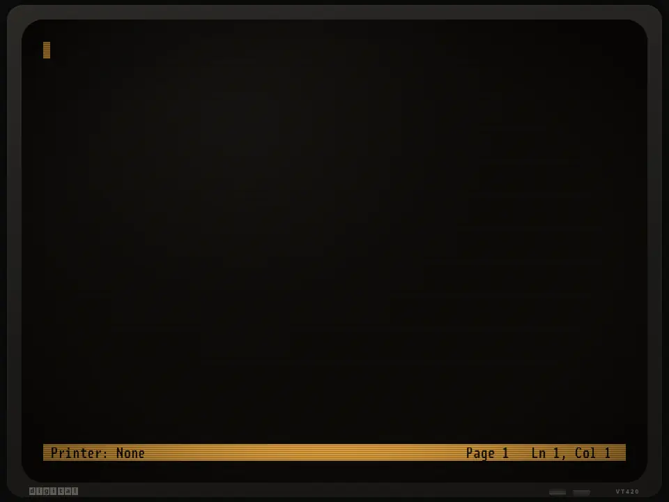

# vt420

A DEC VT420 for programs: an SDK for the ones that drive the real terminal, and the terminal itself, emulated as
the real one behaves and calibrated against it and its firmware.



- **`@mrq/vt420`**, the SDK (`packages/vt420`): what the terminal on the other end is and can do, found by asking it;
  frames drawn in the fewest bytes a serial line has to carry, with hardware scrolling inside margins, smooth scroll,
  rectangles, double-size lines and the status line; its keyboard decoded, LK401 keys and all; its character sets.
  No dependencies. [pi-vt420](https://github.com/mrq1911/pi/tree/vt420/packages/coding-agent/src/experimental/vt420)
  and [zellij-vt420](https://github.com/mrq1911/vt420-term) draw with it.
- **`@mrq/vt420-emu`**, the emulator (`packages/vt420-emu`): a VT420 in memory, its serial line, and its own font,
  read from its firmware. It needs the SDK for the character sets and nothing else; pi-vt420 and zellij-vt420 are
  tested on it.
- **`vt420`**, the emulator in a browser window, and the tools `vt420-probe`, `vt420-demo`, `vt420-animations` and
  `vt420-setup`: not published, installed from this repository.

## Install

```bash
git clone https://github.com/mrq1911/vt420 ~/.local/share/vt420
~/.local/share/vt420/install.sh
```

`install.sh` installs the dependencies without lifecycle scripts, builds node-pty's native module (a C++ compiler and
make are needed), and links the commands into `~/.local/bin`, `vt420-update` among them, which pulls and does it
again. Node 22.18 or newer runs the TypeScript as it is, so nothing is built.

## vt420, the terminal in a browser window

`vt420` is the terminal itself, for when the real one is not at hand: your shell, or `vt420 -- program`, runs in a
pseudo-terminal with `TERM=vt420`, and a local page is the VT420 it talks to. pi-vt420 finds a VT420 in it and draws
natively; vt420-term, and with it zellij, runs in it as on the real terminal.

```bash
vt420                       # your shell
vt420 -- pi                 # pi-vt420
vt420 --baud 19200 -- top   # no faster than a serial line
vt420 -- zellij-vt420       # zellij through vt420-term
vt420 --demo                # vt420-demo, round and round
vt420 --animations          # vt420-animations, round and round
```

It opens an app window of Chromium, Chrome, Brave or Edge, or else the default browser; `--no-open` prints the
address instead. The server listens on 127.0.0.1 only, and the page's WebSocket needs the token in that address.
Closing the window hangs the program up 15 seconds later; a reload in the meantime finds it again, its screen drawn
from what it wrote, and `--keep` keeps it for the next window. See `vt420 --help`.

| PC key | VT420 key |
| --- | --- |
| F1-F4, or Num Lock, keypad / * - | PF1-PF4 |
| F6-F12 | F6-F12 |
| Shift or Alt with F1-F10 | F11, F12, F13, F14, Help, Do, F17, F18, F19, F20 |
| Ctrl with an F key | that key with Shift: a user-defined key |
| Insert, Delete, Home, End, Page Up, Page Down | Insert Here, Remove, Find, Select, Prev Screen, Next Screen |
| keypad +, Alt with keypad - | the keypad's comma and minus |
| Escape | ESC, which the LK401 does not have |
| Alt with a key | ESC and the key (Set-Up can turn it off) |
| Ctrl+F1, Scroll Lock, Pause | Hold Screen |
| Ctrl+F3, the Menu key, or a click on the bezel's label | Set-Up; `vt420-setup` in the terminal opens it too |
| Alt+Enter | full screen, where Ctrl+W and the like reach the program too |

**Set-Up** is a screen of its own, drawn by the terminal: columns, lines and pages, the status line, the cursor, jump
or smooth scroll and its speed, the operating level and 7- or 8-bit controls, the identity DA gives, the supplemental
set, national mode, keys, keyclick, bell, local echo, a line speed, and the look: the phosphor (white, green or
amber), how heavy the characters are drawn, and how long the phosphor glows after a dot goes dark. Brightness and
contrast are two thumbwheels under the screen, as on the terminal: drag them or turn them with the mouse wheel.
Changes act at once; Save keeps them in the browser, Recall and Default go back to the saved ones or the factory's.
Until something is saved the page starts from the Set-Up pi-vt420's README lists (jump scroll, 6 pages of 24 lines,
keys locked), with autowrap on for a shell's long lines. Dragging the mouse copies text, and Ctrl+Shift+V pastes.

## What it does

What the programmer reference (EK-VT420-RM) describes for one session:

- **Screen**: 80 or 132 columns and 24, 36 or 48 lines; six pages of page memory, with NP, PP, PPA, PPR and PPB,
  panning, and pages longer than the screen (DECSLPP); the indicator and host-writable status lines; double-width
  and double-height lines; smooth scroll that glides a scan line at a time while what follows waits; scrolling
  margins on all four sides.
- **Editing**: insert and delete of characters, lines and columns, DECBI and DECFI, selective erase (DECSCA), and the
  rectangles: DECCRA across pages, DECFRA, DECERA, DECSERA, DECCARA and DECRARA with DECSACE.
- **Characters**: ASCII, DEC Special Graphics, DEC Technical, DEC Supplemental, ISO Latin-1 and the eleven national
  replacement sets, locking and single shifts, soft fonts (DECDLD), 7- and 8-bit controls.
- **The rest**: user-defined keys (DECUDK), macros (DECDMAC, DECINVM), VT52 and VT100 modes, every mode DECRQM asks
  about, and the reports: DA (all three), DSR in its forms, DECRQSS, DECRQM, DECCIR and DECTABSR with DECRSPS, the
  terminal state report with DECRSTS, DECRQCRA, DECRQDE and DECRQUPSS.

Bytes from 0x80 are what a VT420 takes them for, C1 controls and the supplemental set; `--utf8` decodes UTF-8
instead, for programs that know nothing else, and what the VT420 has no glyph for is drawn from VT323 (by Peter Hull,
in `src/web/fonts`), box drawing so it meets its neighbours. Not there: two sessions and their windows, the printer
port, PC TERM mode, key position reports and display controls mode.

## As the real one does it

It behaves as the real terminal, faults included: a screen switched to 48 lines with pages of 24 shows blank lines
under them, DECSTR turns autowrap off, and anything a VT420 does not know is ignored the way it ignores it. Where the
reference and the terminal part, it goes with the terminal, a North American VT420 that vt420-probe recorded: DECRQSS
answers 1 for a setting it knows, DECRQM keeps the mode asked about in a byte, 0xA0 in a 94-character set is the error
character, G2 and G3 hold the user-preferred set as `<`, and DECRQCRA sums what the terminal keeps for each cell (the
character's code in its font, nothing for an erased cell, 0x400 for underline, 0x800 for protected, 0x2000 for bold,
0x4000 for reverse, 0x8000 for blink). It takes its time as that terminal does, too: a character in 0.45 ms (slower
than 38400 baud brings them), a scroll in 13 ms, a glide in 94. Tests can put it behind a serial line
(`packages/vt420-emu/src/line.ts`) with the terminal's timing: characters ten bit times apart, the 254-character
input buffer with XOFF at Set-Up's 64 or 128, at 220 and at every character that finds it full, XON at 32, input
that waits while a line glides, limited transmit, and a host that stops a few characters after XOFF or never, as one
behind ssh. vt420-term's pacing is tested that way on a terminal set up as the factory sets it, smooth scroll and all.

`vt420-probe`, run on a real VT420, checks this against the terminal itself: it puts the terminal through cases where
the reference leaves room or emulators disagree, asks after each where the cursor went, the checksums of the screen
(DECRQCRA) and the modes, records its reports and how long it takes to glide, scroll and answer, and writes them to a
file (it leaves out DA3, the unit's serial number, and the answerback). Kept in `packages/vt420-emu/test/fixtures`,
the conformance test runs the same cases on the emulator and lists every answer that differs. Run it from a login on
the terminal itself, with nothing on the screen to keep: `vt420-probe ~/vt420-probe.json`.

[Blaze](https://github.com/mmastrac/blaze), an emulator of the terminal's hardware, runs the VT420's own firmware,
V1.4 as on that terminal, and gives two things more:

- **The probe without the terminal**: `scripts/firmware-probe.ts` asks the firmware everything `vt420-probe` asks the
  terminal and keeps the answers beside the terminal's, checked the same way. 70 of the 72 cases come out as on the
  terminal (the other two depend on its tab stops), so a new case can be asked in seconds; the settings the firmware
  starts from differ, as the conformance test allows for. Blaze boots it as the worldwide VT420; the terminal recorded
  is the North American one, VT420 AV1.4 in its Set-Up, which the same ROM becomes by a pin it reads at power-up. It
  drops the language and keyboard choices from Set-Up and the 9 (national character sets) from DA1, the one answer
  of the probe it changes.
- **The characters, dot for dot**: the character generator as the firmware loads it into video memory, a font for
  each height of row (16 scan lines at 24 lines, 10 at 36, 8 at 48) and each width (10 dots at 80 columns, 6 at 132).
  Each cell draws the glyph the firmware would, picked by the set the character came from, so DEC Technical's corner
  is not line drawing's; `packages/vt420-emu/src/font.ts` has the lookup, checked against the firmware for every
  character of every set.

## Demo and animations

`vt420-demo`, recorded at the top, shows a VT420 what it can do, on the VT420 it runs on, the real one or vt420:
double-size lines and attributes, line drawing and DEC Technical, rectangles, smooth scroll inside margins, two
windows with left and right margins, a marquee and columns going in and out, a soft font, six pages drawn out of
sight and flipped through, 132 columns and 48 lines, the alignment pattern and selective erase, with the status line
saying where it is. `n` goes on to the next scene, space pauses, `q` stops; the terminal's modes are put back
afterwards.

`vt420-animations` plays the classic VT100 animations of [textfiles.com](http://artscene.textfiles.com/vt100/) (the
spinning globe, the Twilight Zone, the Torture Test, fireworks, Don Bertino's Disneyland) at 9600 baud, the speed
they were made for. They are fetched into `~/.cache/vt420/animations` the first time and are not part of vt420. The
playlist leaves out the seasonal ones (`--holidays`) and the rude ones (`--all` has everything); `n`, `p`, `+` and
`-` go on, back, faster and slower; the status line stays blank but for a few seconds after a key, when it shows
them. `--list` shows the playlist, `--baud` sets the speed.

Both pace what they send by the terminal's answers, two pieces of under a hundred bytes out at most, so a VT420 on a
fast line, gliding or not, is never sent more than its input buffer holds.

## Development

```bash
npm install --ignore-scripts && npm rebuild node-pty
npm run check   # biome and tsc over everything
npm test        # the emulator's own tests and conformance, and the SDK's, drawn on the emulator
npm run build   # the packages' dist/, which npm publish builds too
```

The packages are npm workspaces and import each other by name, `@mrq/vt420/renderer.js` and the like. Here those
names resolve to the sources, through the `source` export condition (`node --conditions=source`, the
`customConditions` of tsconfig.json, the aliases of vitest.config.ts, and the page's import map); published, to
`dist/`. The SDK's tests live at the top, beside the browser terminal, so that the SDK does not depend on the
emulator even to be tested.

A release is a new version in a package's package.json: CI (`.github/workflows/ci.yml`) checks and tests every push,
and on main publishes each package whose version npm does not have yet, the SDK first, through npm's trusted
publishing, with provenance. Programs that use them take the new version when they bump their dependency.

MIT licensed; the VT323 font in `src/web/fonts` is under the SIL Open Font License.
